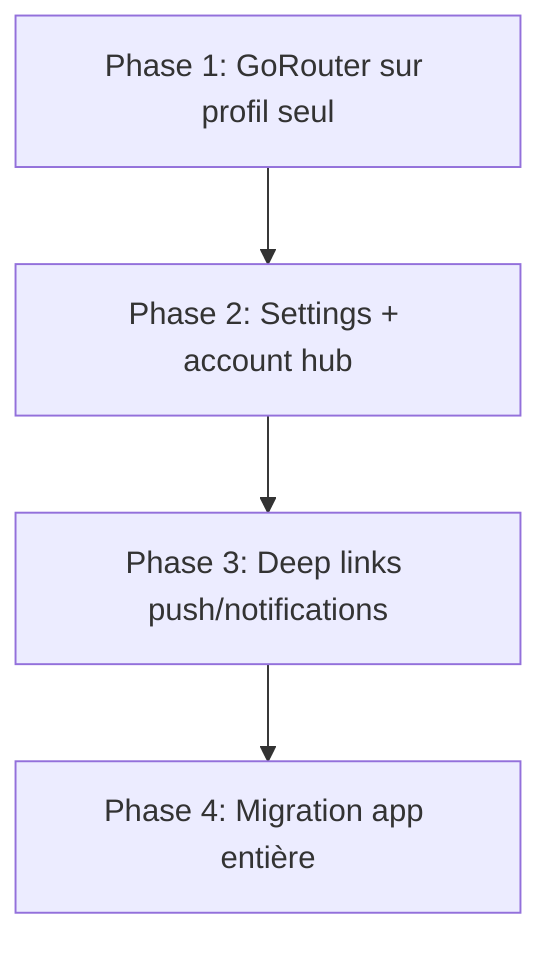

# Migration GoRouter — Profils & Paramètres

> Document de planification. **Aucune implémentation GoRouter** dans le chantier profils/paramètres v2 — navigation impérative (`Navigator.push`) conservée.

## Contexte

L'app utilise aujourd'hui `MaterialApp(home: AuthWrapper)` + `Navigator.push` / `MaterialPageRoute` sans routes nommées. L'espace profil/paramètres compte **26 écrans** sous `lib/screens/profile/`.

## Routes cibles (futures)

| Route | Écran | Deep link souhaité |
|-------|-------|-------------------|
| `/profile` | `ProfileScreen` | Onglet profil |
| `/profile/account` | `AccountHubScreen` | Bandeau sécurité |
| `/profile/account/edit` | `EditProfileScreen` | — |
| `/profile/account/preview` | `ProfilePreviewScreen` | — |
| `/profile/account/security` | `AccountSecurityScreen` | — |
| `/profile/account/privacy` | `PrivacyScreen` | — |
| `/profile/account/data/export` | `ExportDataScreen` | RGPD |
| `/profile/account/data/delete` | `DeleteAccountScreen` | — |
| `/profile/media` | `MyMediaScreen` | — |
| `/settings` | `SettingsScreen` | — |
| `/settings/notifications` | `NotificationSettingsScreen` | Push système |
| `/settings/notifications/dnd` | `DndScheduleScreen` | — |
| `/settings/muted` | `MutedConversationsScreen` | — |
| `/settings/storage` | `StorageScreen` | — |
| `/settings/network` | `NetworkDataScreen` | — |
| `/settings/playback` | `PlaybackSpeedScreen` | — |
| `/settings/accessibility` | `AccessibilityScreen` | — |
| `/settings/about` | `AboutLegalScreen` | — |

## Stratégie de migration progressive

1. **Phase 1** — Introduire `go_router` en parallèle : `ShellRoute` pour `HomeScreen` avec branche `/profile/*` uniquement.
2. **Phase 2** — Migrer `SettingsScreen` et sous-écrans ; conserver `Navigator.push` legacy via wrapper de compatibilité.
3. **Phase 3** — Deep links : bandeau email → `/profile/account/security/email`, notif paramètre → `/settings/notifications`.
4. **Phase 4** — Chats, appels, statuts, réunions (effort majeur, ~2–3 semaines).

## Estimation effort

| Phase | Effort | Risque régression |
|-------|--------|-------------------|
| 1 — Profil | 3–4 j | Faible |
| 2 — Paramètres | 2–3 j | Faible |
| 3 — Deep links | 2 j | Moyen |
| 4 — App entière | 15–20 j | Élevé |

## Prérequis techniques

- Package `go_router` (déjà compatible Provider / `AuthWrapper`)
- `redirect` global : non authentifié → `/login`
- Préserver `appNavigatorKey` pour PushService et CallKit
- Tests widget sur routes profil critiques

## Décision actuelle

Le chantier v2 livre la **restructuration fonctionnelle** sans GoRouter. Ce document sert de référence pour un chantier navigation dédié ultérieur.
